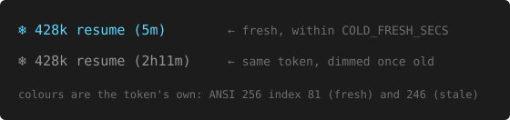

# claude-worktime

Track active working time in [Claude Code](https://claude.com/claude-code) sessions.

```
my-org/my-project (main ✓) · ⏱  today 2h32m 🤖55m 👤1h37m · total 12h30m
08:22 ▪▪▪···▪▪▪▪··▪▪▪ 17:30 · ▶ 1h12m ⏸ 20m
Opus 5 (session) · ⧗30% ↻3h21m →51% · ➐ 5% ↻Sat · ctx 77% · ❄ 428k resume (5m)
```

Three lines, three perspectives on the same data:
- **Line 1** — work done: project time with Claude/You split
- **Line 2** — your day: presence timeline, break rhythm
- **Line 3** — model, rate limits, token budget, context, and the last cold-cache rewrite

The `❄` above is a FRESH one; past `COLD_FRESH_SECS` (default 15min) the same
token dims to gray, so an old event recedes instead of reading like a new one.
The fence above is monochrome and cannot show that, so here is the difference
itself:



`428k resume` is a cost class, not a bug: resuming a session re-writes the
prefix and the number is what it cost you — see
[the `{cold}` token](#configuration) for the full vocabulary.

**Platform:** Linux is the primary target (developed and tested on it). macOS is supported as a second-class target with vanilla system bash 3.2 — no Homebrew bash or coreutils required, just `jq`. Windows is not supported.

## Install

```bash
git clone https://github.com/Gunther-Schulz/claude-worktime.git
cd claude-worktime
./install.sh --statusline
```

Or with curl:

```bash
curl -fsSL https://raw.githubusercontent.com/Gunther-Schulz/claude-worktime/main/install.sh | bash -s -- --statusline
```

Then **restart Claude Code**. That's it — time tracking starts automatically.

Options: `--statusline` enables the status bar, `--force` overwrites existing hooks.

Recommended next step: enable the **cold guard** — set `CACHE_GUARD_TTL=3600` in `~/.config/claude-worktime/config.sh`. It's the one feature left off by default because it interrupts you rather than just informing you, and the only one that saves a cold-cache rewrite instead of reporting it after the fact. Details under [Configuration](#configuration).

<details>
<summary>What the installer does</summary>

- Copies the script to `~/.local/bin/claude-worktime`
- Creates default config at `~/.config/claude-worktime/config.sh` (preserved on reinstall)
- Copies the cache-bust runbook to `~/.claude/cachebust-runbook.md` (refreshed every install — it is documentation, not your state)
- Appends event hooks to `~/.claude/settings.json` (SessionStart, UserPromptSubmit, PreToolUse, PostToolUse, Stop, StopFailure) — preserves hooks from other tools
- Verifies dependencies

</details>

## Uninstall

```bash
./uninstall.sh
```

Removes hooks, statusline config, and the script. Logs and config are preserved.

## What you see

### Statusline

Up to 3 configurable lines. Every element is a token — mix and match what matters to you.

**Line 1 — Work done** (project-scoped):
```
my-org/my-project (main ✓) · ⏱  today 2h32m 🤖55m 👤1h37m · total 12h30m
```
Total productive time, split into Claude's work and yours. Scoped to the current project.

**Line 2 — Your day** (cross-session):
```
08:22 ▪▪▪···▪▪▪▪··▪▪▪ 17:30 · ▶ 1h12m ⏸ 20m
```

| Element | Meaning |
|---------|---------|
| `▪▪··▪▪▪` | Day timeline — ▪ = present, · = away |
| `08:22` | Start time (first event today) |
| `17:30` | Time of the last statusline render — how far it lags your actual clock is how stale the session is |
| `▶ 1h12m` | Presence streak since last break (yellow >1.5h, red >2.5h) |
| `⏸ 20m` | Duration of most recent break |

The end time is the **staleness anchor**. A statusline only re-renders when something happens, so an idle CLI freezes the whole line — every duration on screen keeps the value it had at the last event, however long ago that was. `{today_now}` is stamped at render, so comparing it against your actual clock reads off exactly how old everything else is: `17:30` on screen at 19:40 means nothing here has updated in over two hours. This is the same trap the `❄` token fell into (see [cold-cache](#configuration)) — an hours-old rewrite still reading `(7m)`.

It is deliberately absolute rather than relative. An `idle 40m` token would be computed at render too, so it would freeze at `idle 3m` and read as fresh forever — confidently wrong. A clock time can go stale but cannot misreport; you supply the "now" it is compared against.

By default it ships only inside `GROUP_TIMELINE`, so trimming `STATUSLINE_2` removes the anchor. To keep it while dropping the timeline — or to sit it on line 3 next to `❄` and `ctx`, where a frozen value is most misleading — give it its own group:

```bash
GROUP_NOW="{today_now}"
STATUSLINE_3="MODEL RATE_5H CONTEXT COLD NOW"
```

Resolution is `%H:%M`, enough for "is this session stale" but not for "did that bust just happen".

The bar itself is one character per time slot (`TIMELINE_SLOT`, default: 1200 seconds / 20 minutes). Set to `1800` for 30-minute, `3600` for hourly, or `900` for 15-minute resolution. The glyphs are `TIMELINE_CHAR_WORK` / `TIMELINE_CHAR_AWAY` — how heavy the bar reads depends on the terminal font, so `▪ ■ █ ▮ ▬` are all worth a try — and they take their color from `COLOR_TIMELINE_WORK` / `COLOR_TIMELINE_BREAK` (both `green` by default, so the bar reads as one shape; set them apart to separate work from away).

**Line 3 — Model & limits**:
```
Opus 5 (local) · ⧗30% ↻3h21m →51% · ➐ 5% ↻Sat · ctx 77% · ❄ 397k other (2m) · @my-project-ab
```

| Element | Meaning |
|---------|---------|
| `Opus 5 (local)` | Active model + config source (local/project/global/session/default) |
| `⧗30% ↻3h21m →51%` | 5h rate limit: used, time to reset, projected at reset |
| `➐ 5% ↻Sat` | 7d rate limit: used, reset day |
| `ctx 77%` | Context window fullness |
| `❄ 397k other (2m)` | Last cold-cache rewrite — size, cause, and (age); cyan when recent, gray once old. Its own `{cold}` token / `COLD` group, so it sits after `ctx` behind a normal ` · ` divider |
| `@my-project-ab` | This session's own peer name — the address other sessions reach it by. Muted, and silently absent when it cannot be resolved; see below |

### CLI queries

```bash
claude-worktime                       # current session
claude-worktime --today               # today's total
claude-worktime --week                # this week
claude-worktime --since 2026-03-25    # since a date
claude-worktime --breakdown --today   # Claude vs You time split
claude-worktime --gaps --today        # gap distribution (tune threshold)
claude-worktime --summary --today     # per-project breakdown
claude-worktime --csv --today         # export as CSV
claude-worktime --cost --today        # cost analysis
claude-worktime --cold                # cold-cache rewrites this session (❄ history)
claude-worktime --cold --all          # ...including compact/resume cost classes
claude-worktime --tokens              # statusline token legend
claude-worktime --rotate              # archive old entries now (normally automatic)
claude-worktime --help                # the header block, incl. the log schema
```

Filters (`--today`, `--week`, `--since`, `--filter`, `--branch`, `--session`) combine with the reporting modes — `--breakdown`, `--gaps`, `--cost`, `--summary`, `--csv`. Two exceptions: `--cold` reads only the time filters and `--session` (it has no project or branch dimension), and `--raw` produces JSON for every mode except `--csv`, which is already an export format.

### Phase breakdown

`--breakdown` shows how time splits:

```
  Claude:     1h 39min     51%
  You:        1h 32min     48%
  ─────────────────────────
  Active:     3h 13min
  Away:       45min        (1)
  Breaks:     20min        (1)
  Downtime:   12h 15min
```

- **Claude** — attended Claude work time
- **You** — your active time (reading, thinking, typing)
- **Active** — Claude + You (total productive time)
- **Away** — prompt-to-prompt spans exceeding threshold (you weren't at your desk)
- **Breaks** — idle gaps outside away spans (you were in the CLI but inactive)
- **Downtime** — quit and came back outside away spans

### Cost analysis

`--cost` shows API-equivalent cost per project:

```
Cost by project:
  Hendrik/26-05 Todenbuettel  $3.46

  Total: $3.46
```

This shows what your session would cost at API rates. On subscription plans (Pro/Max), this is informational — not your actual bill. Your real budget is the rate limit windows.

### Cold-cache history

`--cold` lists the cold-cache rewrites the `❄` token only shows one of — the current session by default, or widened with `--today` / `--week` / `--since` / `--session`:

```
when (UTC)              size  cause                 idle  model
2026-07-23 04:34:32     130k  idle                 2h00m  opus-4-8
2026-07-23 05:23:03     397k  messages_changed       49s  fable-5
total                   527k  (2 rewrites)
```

Each row is one full-context rewrite paid at the cache-write premium: its size, cause (`idle` / `model`, or — when neither explains it — the API's own `cache_miss_reason.type` such as `messages_changed`/`tools_changed`/`unavailable`, falling back to plain `other` when no diagnostics were available), the idle gap before it, and the model in play. Add `--raw` for JSON. Cause and model are blank for events logged before that field existed.

**Timestamps are UTC, deliberately.** Every downstream forensic source — transcripts, `journalctl --utc`, snapshot ledgers — stamps in UTC, and a local-time column here forces a conversion at exactly the moment someone is hunting a bust. (On 2026-07-28 a bust reported at "00:13 local" was hunted in the 22:13Z ledger rows.)

### Cache-bust investigation

Every recorded hit (not a resume artifact — see below) fires a desktop
notification, if `notify-send` is available, pointing at
[`docs/cachebust-runbook.md`](docs/cachebust-runbook.md) — installed to
`~/.claude/cachebust-runbook.md` so it's in a fixed, findable place. The
runbook is written for a fresh Claude session with no prior context: hand
it the notification and it starts by telling `idle`/`model`/deliberate
causes (nothing to investigate) apart from the rest, then walks through
`claude-worktime --cold` plus, where available, the wire-level and
transcript layers to find out what actually happened.

**Don't want the popup?** Set `COLD_NOTIFY=false`. Busts are still logged and still shown
by `❄` and `--cold`, just silently. This notification is the only thing the tool pushes at
you unprompted; the [cold guard](#configuration) is the only thing that *blocks*, and it
is off by default.

Two companion notes go deeper than this README:
[`docs/cold-cause-api-diagnostics.md`](docs/cold-cause-api-diagnostics.md) — where the
cause strings come from — and
[`docs/token-cost-model.md`](docs/token-cost-model.md) — how a rewrite is priced.

## Configuration

Config file: `~/.config/claude-worktime/config.sh` — plain bash, sourced at startup. All defaults are built into the script; the config only needs settings you want to override.

A commented-out template with all options is created on install.

### Tokens

**Time tokens** (from activity log):

| Token | Description |
|-------|-------------|
| `{status}` | ⏱ icon |
| `{session}` | Active time in current session |
| `{session_wall}` | Wall clock time since session started |
| `{today}` | Today's total active time (all sessions, all projects) |
| `{today_wall}` | Wall clock span of today (first event to now) |
| `{today_start}` | Start time today (e.g. `08:22`) |
| `{today_now}` | Clock time at the last render (e.g. `19:25`) — the staleness anchor, see below |
| `{today_project}` | Today's total for current project (Claude + You) |
| `{today_claude}` | Today's Claude work time for current project |
| `{today_you}` | Today's your active time for current project |
| `{project_total}` | All-time total for current project |
| `{total_claude}` | All-time Claude work time for current project |
| `{total_you}` | All-time your active time for current project |
| `{since_break}` | ▶ 2h40m — presence streak since last break |
| `{last_break}` | ⏸ 41m — most recent break duration (hidden until first break) |
| `{timeline}` | ▪▪··▪▪▪ — day timeline (▪=present ·=away), one char per `TIMELINE_SLOT` |

**Project tokens:**

| Token | Description |
|-------|-------------|
| `{project}` | Project name (last 2 path segments) |
| `{branch}` | Git branch name |
| `{git}` | Branch + state: `main ✓` `main ✗` `main +` `main ?` `main ↑2` `main ↓1` |

**Claude Code tokens** (from statusline stdin JSON):

| Token | Description |
|-------|-------------|
| `{rate_5h}` | 5h rate limit usage (e.g. `30%`); the `⧗` label lives in `GROUP_RATE_5H` |
| `{rate_5h_reset}` | Time until 5h window resets |
| `{rate_5h_proj}` | Projected 5h usage at reset (yellow ≥90%, red ≥100%) |
| `{rate_7d}` | 7-day rate limit usage |
| `{rate_7d_reset}` | Time until 7d window resets |
| `{rate_7d_day}` | Reset weekday (e.g. `Sat`) |
| `{rate_7d_proj}` | Projected 7d usage (`→…` while insufficient data) |
| `{rate_7d_scoped}` | Model-scoped weekly limit (e.g. the Fable bucket on Max plans) |
| `{rate_7d_scoped_name}` | Name of the scoped model (e.g. `Fable`) |
| `{rate_7d_scoped_proj}` | Projected scoped usage at week's end |
| `{context}` | Context window usage (e.g. `77%`) |
| `{cold}` | Most recent cold-cache rewrite as `❄ 397k other (2m)` — size, cause, and (age); cyan when recent, gray after `COLD_FRESH_SECS`; empty until the first. Its own `GROUP_COLD` group so the ` · ` divider is inserted automatically |
| `{cost_budget}` | Actual cost / inferred 5h budget (e.g. `$19.65/≈$40`) — includes agent costs. The `≈` value is estimated; see below. |
| `{cost}` | Session cost (e.g. `$1.23`) |
| `{model}` | Model name + source when overridden (e.g. `Opus 4.6 (local)`) |
| `{effort}` | Reasoning effort level (`low` / `medium` / `high` / `xhigh` / `max`). Hidden when the active model doesn't support effort. |
| `{peer_name}` | This session's own cross-session peer name, rendered with an `@` prefix (e.g. `@my-project-ab`) so it reads as an address — the one other sessions reach it by. Matched from the stdin session id against Claude Code's live-session registry; silently empty when that lookup does not resolve. See below |

Empty tokens are automatically removed along with their surrounding separators.

**The project label (`{project}`):** By default the label is the last two path segments of the working directory — `my-org/my-project`. Two options reshape it:

| Option | Default | Effect |
|--------|---------|--------|
| `HOME_ORG` | `""` | Drops a leading `org/` from the label, for the one org segment that is redundant on your machine (typically your code-host user directory). `HOME_ORG="my-org"` turns `my-org/my-project` into `my-project`. |
| `PROJECT_GIT_ANCHOR` | `false` | Anchors the label to the git repo root, so a subdirectory or a linked worktree shows the repo instead of the directory you happen to be in. |

**`PROJECT_GIT_ANCHOR` and worktrees.** Agent worktrees are when you meet this option. Since 2026-08-07 the anchor resolves through `git rev-parse --git-common-dir`, which is shared by every worktree of a repo; it previously used `--show-toplevel`, which is worktree-scoped and therefore returned the worktree's own root — the exact thing the option exists to escape. Concretely, for a worktree at `<repo>/.claude/worktrees/agent-1a2b`:

| | label with the anchor off | anchored (before) | anchored (now) |
|---|---|---|---|
| a subdirectory of the repo | the subdirectory | the repo | the repo |
| a linked worktree | `worktrees/agent-1a2b` | `worktrees/agent-1a2b` | the repo |

Where `--git-common-dir` is unavailable (git < 2.31) or the repo has a non-standard layout, it falls back to `--show-toplevel` — still correct for subdirectories, wrong only where it was always wrong.

One scope limit worth knowing: the anchor rewrites the **label** only. Totals are still aggregated on the raw logged path, so `{today_project}` and `{project_total}` count a worktree separately from its parent repo even while both display the same name.

**Model source detection:** The `{model}` token shows where the active model setting comes from. The source label is only shown when the model is overridden: `local` (`.claude/settings.local.json`), `project` (`.claude/settings.json`), or `session` (`/model` or `--model` override). When the model comes from the global default (`~/.claude/settings.json`) or no setting is found, just the model name is shown without a label. The source is inferred by comparing the running model against settings files — it may be inaccurate if settings files are changed mid-session without restarting Claude Code. Context-window suffixes are stripped on both sides: `Opus 4.7 (1M context)` displays as `Opus 4.7`, and a settings value like `claude-fable-5[1m]` still matches the running `claude-fable-5`.

**Per-model colors:** `MODEL_COLORS` colors the `{model}` token by model — a comma-separated list of `substring=color` pairs matched case-insensitively against the model id and display name; first match wins, unmatched models keep the group color. Default: `fable=pink,opus=cyan`. Example pinning all families: `MODEL_COLORS="fable=pink,opus=purple,sonnet=cyan,haiku=blue"`.

**Cold-cache counter & guard:** After an idle gap longer than the prompt-cache TTL (~1h for Claude Code's main thread), the next request silently re-writes the entire conversation prefix at the cache-write premium. Claude Code warns about this when *resuming a closed session*, but not when a session sits open and idle in a terminal — that gap is covered here, twice.

**The `{cold}` token — what it shows:** The `❄ 397k other (2m)` marker — its own `{cold}` token, rendered as a `COLD` group so a ` · ` divider sets it off from `ctx` — shows the size, cause, and age of the most recent cold rewrite this session: the tokens re-written at the write premium (the felt cost; a bare count would flatten a 500k event and a 25k one into the same number), why it went cold, and how long ago, parenthesised so it reads plainly as elapsed time (the age answers what a static value can't: did this just happen, or is it old news?). It renders cyan while recent and dims to gray after `COLD_FRESH_SECS` (default 15min) so a ghost value recedes. A session index is prefixed once there is more than one rewrite (`❄ #3 263k idle (4m)`), on bust-class causes only — `#N` counts busts, so showing it beside a `compact` or `resume` label would misread as that class's count. It leads rather than trails because a trailing `×3` reads as a multiplier on the event it follows — "this 263k idle bust, three times" — the opposite of the truth; as a leading ordinal it frames what comes after it ("bust #3; the latest was 263k, idle, 4m ago"). The count is also the only part of the token that survives a frozen statusline (see [the staleness anchor](#statusline)): a monotonic count can only under-report, never mislead, while the age freezes.

**How a rewrite is detected:** Cold rewrites are detected from usage: a request that wrote most of the previous context while reading almost none of it back from cache — so `/compact` is never mistaken for a bust — its post-boundary first write displays as its own `compact` cost class (below) — while an idle gap or a model switch that changes the cache key books a real bust. A session's *first* write looks identical (nothing cached yet, whole context written) but is skipped structurally — it's flagged only when a prior turn already exists this session, so a fresh start is never mistaken for a rewrite while a resume after the cache expired still counts. `COLD_MIN_CTX` is an optional cosmetic floor on top (default 0 — shows everything; raise it to hide small rewrites).

**Cause classification:** Every event is also logged with its exact size and a cause classification (`{"type":"cold",…,"cc":130000,"cause":"idle","mdl":"claude-…"}`): `idle` (gap past the cache TTL) and `model` (the model changed since the previous turn — a cache-key switch) are classified first, from state worktime already tracks. Everything else asks the Claude Code API directly: the assistant transcript entry at the rewrite carries its own `message.diagnostics.cache_miss_reason` (`{type, cache_missed_input_tokens}`), and that `type` — `messages_changed`, `tools_changed`, `system_changed`, `previous_message_not_found`, or `unavailable` — becomes the logged cause verbatim, falling back to plain `other` only when no diagnostics were available (e.g. an older Claude Code version). That set is what 1,137 events across local transcripts actually contained (2026-07-31: `messages_changed` 999, `tools_changed` 53, `unavailable` 51, `previous_message_not_found` 28, `system_changed` 6) — observed, not exhaustive, and passed through verbatim, so a type not in this list still logs correctly. `previous_message_not_found` means the transcript was resumed, forked, or compacted rather than busted mid-session.

**Cost classes vs busts:** The ❄ token is a cost meter, not just a bug alarm: these are REAL misses the user should see as feedback on what their action cost, so they display with an honest label — `compact` when a `compact_boundary` transcript entry explains the write (`auto-compact` when its `compactMetadata.trigger` says the context ceiling, not the operator, forced it), else `resume` (e.g. `❄ 51k compact (2m)`) — but they are never busts: logged as `k:"cost"` instead of `k:"hit"`, excluded from `--cold`'s default history (`--cold --all` includes them), never advancing the `#N` bust index, and never firing the desktop notification. The same applies to a post-`/compact` first write whose size never even met the hit predicate: with a `compact_boundary` newer than the last real turn it displays as `compact` cost; without that evidence it stays silent. **The boundary is the only test there — no size or ratio condition rides along**, because compaction is usually *not* a full fresh write. The cache key is a prefix, and the system prompt and tool definitions sit ahead of the messages: a compact leaves them byte-identical, so while the cache is still live the provider serves that prefix from cache and writes only the summary. Measured 2026-08-14 across two sessions compacted the same afternoon — the one whose cache had also expired wrote `cr=0 cc=77475` and looked like a fresh write; the one compacted while warm wrote `cr=105164 cc=8040` and looked like an ordinary turn. (That first session had gone 3h03m without an upstream call — it was working the whole time, on local tools. What kills a cache is time since the last API call, not time since the user last did something, and a busy session can let its cache die.) Both are compacts, and only the boundary tells you so; a ratio test sees the first and misses the second, which is why the `❄` token in the warm session went on quoting a 294k bust from nearly seven hours earlier. The boundary also bounds the booking by itself: the first post-compact write advances the last-turn clock past the boundary, so no later turn can re-book it. If a hit was already booked from a raced diagnostics read and `previous_message_not_found` surfaces within the late-bind window, the hit is retracted (`k:"hit-retract"`, honored by all `k:"hit"` readers) and the display relabels to its cost class rather than hiding.

**Forensic fields on a hit:** On a real hit (`k:"hit"`), the log also carries per-event forensic fields (`mtok`, `pblk`, `flight`, `ubytes`, `concur`) so each occurrence is self-analyzing rather than requiring a fresh forensic pass — see [`docs/cachebust-runbook.md`](docs/cachebust-runbook.md) for what they mean and how to investigate one.

**Desktop notification:** The `❄` display above is always on and passive — it never blocks, though a real hit also fires a desktop notification (via `notify-send`, if present) pointing at that runbook; `COLD_NOTIFY=false` turns the popup off, as noted under [Cache-bust investigation](#cache-bust-investigation). The test suites set that flag internally — they drive the real detector with synthetic fixtures, and without it a test run raises popups indistinguishable from live busts (on 2026-07-27 a fixture's `130000` and `160287` surfaced as "Cache bust: 130k / 160k re-cached" and were investigated as unexplained production events). That notification is **derived from the ledger record that was actually committed**, not re-rendered from live variables: the append emits the record it wrote on success, and the notification parses its numbers back out of that string. If the write does not land, no popup fires. The two were previously independent renderings of one event and could disagree silently — with the ledger, the artifact you would audit, being the side nobody checks. The popup also carries the short session id, because concurrent sessions produce concurrent popups (2026-07-27: three busts in 166s across two sessions, indistinguishable at the popup level).

**Cold guard — the one feature that acts:** Separately, an opt-in **cold guard** can warn you *before* a rewrite: it runs inside the `UserPromptSubmit` hook (`claude-worktime log --prompt`, already installed) and is **off by default** (`CACHE_GUARD_TTL=0`) — not because it's second-rate, but because it is the one feature here that *acts*. Everything else in this tool observes and prints; the guard swallows a prompt you just submitted. Inheriting that from an installer would be a bad surprise, so it ships inert and you turn it on knowingly. **Turning it on is recommended** — it is the only part of the cold-cache machinery that can save a rewrite rather than report it afterwards, and the display keeps working either way.

**Enabling and tuning the guard:** Set `CACHE_GUARD_TTL` to the cache TTL in seconds (e.g. `3600`) to enable it; the first prompt after an idle gap past `0.9 × CACHE_GUARD_TTL` (→ 54min at a 3600s TTL, mirroring the CLI's own `elapsed < TTL×0.9` warmth test) with at least `CACHE_GUARD_MIN_CTX` context (default 50k tokens) is then blocked with a warning — the cheapest time to `/compact` or `/clear`, since the cache is lost either way. Submitting the prompt a second time proceeds normally, and the guard warns only once per gap. The warning also carries the session's running total (`Session so far: 3 rewrite(s), ~626k.`), computed at read time from the hit ledger — unlike the `❄` token, which shows only the most recent event at whatever age it had when the statusline last rendered (see [the staleness anchor](#statusline)). Anything the guard prints is true at the moment you read it, and a running total answers "is this actually costing me" in a way a single most-recent event cannot. One deliberate silence: after a `/compact`, the guard's numbers (read from the last tokens entry — compaction writes none) describe a context that no longer exists, and the old prefix is already discarded — so a `compact_boundary` newer than that entry suppresses the warning entirely (logged as `k:"stale-ctx"` so a suppression is distinguishable from a guard that never ran).

**What happens to your blocked prompt:** To make that resend painless — especially for a long prompt — the blocked text is copied to your **system clipboard** (`wl-copy` on Wayland, `pbcopy` on macOS, `xclip`/`xsel` on X11; first one found wins, best-effort), so resending is just paste-and-submit; Claude Code also echoes it back under the warning as a fallback. Set `CACHE_GUARD_CLIPBOARD=false` to leave the clipboard untouched. Text only: the `UserPromptSubmit` payload carries just the prompt string with no image/attachment field, so a pasted image can't be copied — re-attach it by hand on resend.

**Verifying the TTL yourself:** Every cold event is logged (`{"type":"cold",...}`, kept 90 days) so the effective TTL can be verified empirically. The TTL itself is hardcoded in the Claude Code CLI with no API to query it — the reverse-engineering record and re-verification commands live in [`docs/cache-ttl-verification.md`](docs/cache-ttl-verification.md).

**Model-scoped weekly limit:** Claude Code's statusline stdin only carries the all-models 5h and 7d buckets. The per-model weekly bucket shown at claude.ai (e.g. "Fable — 36% used" on Max plans, where Fable is capped separately from the overall weekly limit) is fetched from `api.anthropic.com/api/oauth/usage` using the OAuth token Claude Code already stores (`~/.claude/.credentials.json`, or the Keychain on macOS), cached in the data dir, and refreshed in the background every `USAGE_FETCH_INTERVAL` seconds (default 60, `0` disables). The statusline never waits on the network — it renders the cached value. If the account has no scoped limit, the tokens stay empty and the group is hidden.

A cached value is only displayed while it is fresh: once the cache is older than `USAGE_STALE_MAX` seconds (default 900) the percentage renders as `?%` and the projection is dropped. The fetch interval is tracked on a separate lock file, so the cache's own timestamp always reflects the last *successful* response — a fetch that keeps failing (expired token, no network, API change) degrades to `?%` instead of showing its last number forever.

**Your own peer name (`{peer_name}`):** Claude Code's UI shows you every *other* session's peer name — the address you message it by — and never the one you are typing into. So the moment you want another session to reach *this* one, you have to work out your own address by elimination. The name is not hidden, just unrendered: Claude Code keeps a live-session registry, one `<pid>.json` per running session, each carrying that session's `sessionId` and `name`. The statusline's own stdin already carries the session id, so the display is a lookup — match the id, show the name, prefixed `@` so it reads as a handle rather than a stray path fragment (the `@` is added only on a found name — the fail-soft empty stays empty, never a bare `@`). It ships as its own `GROUP_PEER` group at the end of line 3, muted like `ctx`.

**When the lookup fails, nothing happens — deliberately.** That registry is an internal format Claude Code does not document (schema observed at CC 2.1.229, `peerProtocol: 1`); it may move, change shape, or disappear under any CLI update. So every failure is silent: a missing directory, no files, no matching session, an unreadable or unparseable file, a file without a `name` field — each leaves the segment out and the rest of the line byte-identical, with the exit status unchanged. The trade is deliberate: a convenience segment must never be able to break the display it rides on, and a statusline that errored on every refresh would be a far worse bargain than one that quietly shows one thing less. `CLAUDE_SESSIONS_DIR` (default `~/.claude/sessions`) points at the registry if yours is elsewhere. The lookup only runs when `{peer_name}` is actually on a line, so removing the group costs nothing at all.

### Groups and layout

Define named groups, then compose lines by listing group names. The divider (`GROUP_DIVIDER`, default ` · `) is inserted between non-empty groups. Empty groups are hidden.

```bash
# Groups
GROUP_PROJECT="{project} ({git})"
GROUP_TODAY="{status} today {today_project} 🤖{today_claude} 👤{today_you}"
GROUP_TOTAL="total {project_total}"
GROUP_TIMELINE="{today_start} {timeline} {today_now}"
GROUP_BREAKS="{since_break} {last_break}"
GROUP_RATE_5H="⧗{rate_5h} ↻{rate_5h_reset} {rate_5h_proj}"
GROUP_RATE_7D="➐ {rate_7d} ↻{rate_7d_day} {rate_7d_proj}"
GROUP_RATE_SCOPED="{rate_7d_scoped_name} {rate_7d_scoped} {rate_7d_scoped_proj}"
GROUP_CONTEXT="ctx {context}"
GROUP_COLD="{cold}"
GROUP_MODEL="{model}"
GROUP_EFFORT="{effort}"
GROUP_PEER="{peer_name}"

# Lines (space-separated group names)
STATUSLINE_1="PROJECT TODAY TOTAL"
STATUSLINE_2="TIMELINE BREAKS"
STATUSLINE_3="MODEL RATE_5H RATE_7D RATE_SCOPED CONTEXT COLD PEER"
GROUP_DIVIDER=" · "
```

**Examples:**

```bash
# Add cost budget to line 3 (opt-in — stabilises after ~65% window usage)
GROUP_BUDGET="{cost_budget}"
STATUSLINE_3="MODEL RATE_5H BUDGET RATE_7D CONTEXT"

# Show reasoning effort next to the model
STATUSLINE_3="MODEL EFFORT RATE_5H RATE_7D CONTEXT"

# Compact single line
GROUP_COMPACT="{project} · {status} {session} ({today}) · {rate_5h}"
STATUSLINE_1="COMPACT"
STATUSLINE_2=""
```

**Per-group colors:** `GROUP_<NAME>_COLOR` gives a group its own color, falling back to `COLOR_NORMAL`.

```bash
GROUP_RATE_7D_COLOR="dark-gray"
GROUP_CONTEXT_COLOR="dark-gray"
```

Five ship muted by default — `GROUP_RATE_7D_COLOR`, `GROUP_RATE_SCOPED_COLOR`, `GROUP_CONTEXT_COLOR`, `GROUP_BUDGET_COLOR` and `GROUP_PEER_COLOR`, all `dark-gray` — and one ships as `none`: `GROUP_COLD_COLOR`. `none` means *do not wrap this group at all* — the `❄` token colors itself (cyan fresh, gray stale), and a group wrapper would repaint over that. Use `none` for any group whose template emits its own ANSI codes.

### Colors

```bash
COLOR_NORMAL="green"              # working normally
COLOR_RATE_WARNING="yellow"       # projected rate ≥90%
COLOR_RATE_CRITICAL="red"         # projected rate ≥100%
COLOR_DEFAULT="dark-gray"         # dividers and secondary text
COLOR_TIMELINE_WORK="green"       # timeline present-slots
COLOR_TIMELINE_BREAK="green"      # timeline away-slots (same by default)
```

`{context}` is not a flat color: past `CTX_RAMP_START` percent (default `20`) it runs its own green → yellow → orange → red ramp, fully red at `CTX_RAMP_END` (default `90`). Below the start it keeps the group color; set `CTX_RAMP_START=""` to switch the ramp off.

Presets: `black`, `red`, `green`, `yellow`, `blue`, `magenta`, `cyan`, `white`, `gray`, `dark-gray`, `light-gray`, `orange`, `pink`, `purple`, `bright-green`, `bright-red`, `bright-yellow`, `bright-blue`, `bright-white`, `dim`, `reset`, `none`. Raw ANSI codes also work.

### Break reminder

`{since_break}` changes color when you've been working too long:

- **Yellow** at `STREAK_WARNING` (default: 1.5 hours)
- **Red** at `STREAK_CRITICAL` (default: 2.5 hours)

A "break" is any period where you weren't actively engaged — whether idle, quit and came back, or Claude was running a long autonomous job. Short Claude turns (up to ~5 minutes at the default 15-minute threshold) are credited as "user might be watching," but longer autonomous runs count toward absence. Set thresholds to `0` to disable.

That credit is `CLAUDE_CREDIT`, in seconds. It defaults to `0`, which means *auto* — one third of `PAUSE_THRESHOLD`, hence ~5 minutes at the default. Set it explicitly to decouple the two.

### Auto-rotation

Old log entries are archived on session start. Daily rotation keeps the active log small.

```bash
AUTO_ROTATE=true
ROTATE_INTERVAL=daily    # daily, weekly, monthly
ARCHIVE_RETAIN_DAYS=730  # prune archives older than this; 0 keeps everything
```

Archives: `activity-2026-03-28.jsonl` (daily), `activity-2026-W13.jsonl` (weekly), `activity-2026-03.jsonl` (monthly). Summary records preserve `{project_total}` across rotations.

Rotation trims the active log, but archives are only ever appended — without a horizon the directory grows linearly forever (~15MB over the first two months). The 730-day default keeps year-over-year comparison possible.

### Environment variables

| Variable | Default | Description |
|----------|---------|-------------|
| `CLAUDE_WORKTIME_CONFIG` | `~/.config/claude-worktime` | Config directory |
| `CLAUDE_WORKTIME_DATA` | `~/.local/share/claude-worktime` | Data directory |
| `CLAUDE_SESSIONS_DIR` | `~/.claude/sessions` | Claude Code's live-session registry, read for `{peer_name}` |
| `CLAUDE_CONFIG_DIR` | `~/.claude` | Claude Code's own data root, read only to find the OAuth token for `{rate_7d_scoped}` |

The first two follow the [XDG Base Directory Specification](https://specifications.freedesktop.org/basedir-spec/latest/); the last two point at Claude Code's own directories rather than this tool's, and are worth setting only if your Claude Code install does not use the defaults.

Everything else — including the idle threshold, `PAUSE_THRESHOLD` — is set in the config file; pointing `CLAUDE_WORKTIME_CONFIG` at a different directory is how you run an alternate configuration. `CLAUDE_SESSIONS_DIR` is the one entry above that can also be set in the config file, which is sourced after it is resolved and therefore wins over the environment.

## How it works

### Events

Six hooks log events to a JSONL file:

| Hook | Event | Meaning |
|------|-------|---------|
| SessionStart | `start` | CLI starts or resumes |
| UserPromptSubmit | `prompt` | User sends a message |
| PreToolUse | `tool_start` | Tool about to execute |
| PostToolUse | `tool_end` | Tool finished |
| Stop | `response` | Claude finished responding |
| StopFailure | `response` | API error (still counts as work) |

The log stores raw events only — concepts like "break" and "idle" are derived at query time based on `PAUSE_THRESHOLD`. Change the threshold and all historical data is reinterpreted.

### Time model

Two models, one fork point — same events, same threshold, same log:

**Active time** (line 1 — "was work happening?"):
Gap-by-gap classification. Each gap between consecutive events is either productive or idle. A user turn (`response → prompt`) exceeding the threshold is idle. All Claude turns count as productive regardless of duration.

**Presence** (line 2 — "was the user at their desk?"):
Prompt-to-prompt spans with capped Claude credit. Claude response time up to threshold/3 (~5 minutes at the default 15-minute threshold) is subtracted — "the user might be watching." Beyond that, excess counts toward absence. This means normal Claude turns don't produce false break dots, while long autonomous runs (overnight jobs etc.) correctly show as breaks for well-being tracking.

The two models agree in normal conversation and only diverge during long autonomous Claude turns. A 25-minute agent job where the user returns immediately shows as a break in line 2 (25 - 5 credit = 20 > 15 threshold), while line 1 counts all 25 minutes as productive Claude work.

**Presence model notes:** The prompt-to-prompt measurement is approximate — return reading time, short work blips between long breaks, and the exact moment you stepped away are not precisely captured. This is fine for its purpose: the break reminder is a health nudge, not a timesheet. Active time (line 1) is always precise.

### Tracking dimensions

Each entry records **session ID**, **project path**, and **git branch**:

- **Session** (`{session}`, `--session`) — tied to Claude Code's session ID, persists across resume
- **Project** (`{today_project}`, `--filter`) — based on working directory
- **Branch** (`{git}`, `--branch`) — git branch at event time

## Diagnostics

```bash
claude-worktime --check     # verify dependencies
claude-worktime --debug     # full diagnostic dump
claude-worktime --repair    # remove corrupt log lines
```

## Log format

JSONL at `~/.local/share/claude-worktime/activity.jsonl`:

```jsonl
{"t":1774632641,"p":"/path/to/project","b":"main","s":"session-uuid","e":"start"}
{"t":1774632642,"p":"/path/to/project","b":"main","s":"session-uuid","e":"prompt"}
{"t":1774632655,"p":"/path/to/project","b":"main","s":"session-uuid","e":"response"}
```

| Field | Description |
|-------|-------------|
| `t` | Unix timestamp |
| `p` | Project path |
| `b` | Git branch (omitted if not in a git repo) |
| `s` | Session ID |
| `e` | Event type |

Activity records carry no `type` field. The same file also holds four typed record kinds, which every reader filters on — `--repair` and the query modes skip what they don't recognise, so an unknown type is inert rather than corrupt:

| `type` | Written when | Carries |
|--------|--------------|---------|
| `tokens` | each statusline render with fresh usage | cache-read/write, input/output, cost, context, 5h window |
| `cost` | session cost changed | `cost`, plus the project/branch/session dimensions |
| `summary` | rotation | per-project active/claude/user totals, so `{project_total}` survives the archive |
| `cold` | cold-cache machinery | a `k` sub-kind, below |

`type:"cold"` records are further split by `k`:

| `k` | Meaning |
|-----|---------|
| `hit` | A real bust. Carries `cc` (tokens re-written), `gap`, `ctx`, `cause`, `mdl`, and the forensic fields `mtok`/`pblk`/`flight`/`ubytes`/`concur`. |
| `hit-cause` | A late cause upgrade for an earlier `hit`, keyed `(s, hit_t)`. The ledger is append-only, so readers apply the correction rather than the record being rewritten — without it a bust whose diagnostics arrived late stayed `other` on disk while displaying correctly. |
| `hit-retract` | Withdraws a `hit` booked from a raced diagnostics read, keyed the same way. Honored by every `hit` reader. |
| `cost` | A controlled cost class (`compact` / `auto-compact` / `resume`) — a real miss, never a bust. Excluded from `--cold` unless `--all`. |
| `stale-ctx` | The guard stayed silent because a `compact_boundary` postdates the context it would have quoted. Logged so a suppression is distinguishable from a guard that never ran. |
| `warn` | A warning actually delivered — the guard blocked a prompt. |
| `gauge` | Written on **every** guard evaluation, silent ones included, with `met` = "both thresholds cleared". A guard that logged only its hits could not be told apart from a guard that never ran; these make the miss rate measurable. `met:1` without a matching `warn` is the one-shot suppression working. |

### Files

| Path | Purpose |
|------|---------|
| `~/.config/claude-worktime/config.sh` | Configuration |
| `~/.local/share/claude-worktime/activity.jsonl` | Active log |
| `~/.local/share/claude-worktime/activity-*.jsonl` | Rotated archives |
| `~/.local/share/claude-worktime/.*` | Internal state — per-session cold counters, usage cache, budget carry-over, rotation errors. Safe to delete; all of it regenerates, though the `{cost_budget}` estimate restarts from scratch. |
| `~/.local/bin/claude-worktime` | The script |
| `~/.claude/cachebust-runbook.md` | The runbook the bust notification points at (refreshed on every install) |

## Dependencies

| Tool | Min version | Required | Used for |
|------|-------------|----------|----------|
| **bash** | 4.0 Linux / 3.2 macOS | yes | `mapfile`, `read -t`, arrays (macOS uses polyfills for bash 3.2) |
| **jq** | 1.6 | yes | JSONL parsing, aggregation |
| **git** | 2.22 | no | `{git}` status token, branch logging |
| **date** | GNU coreutils or BSD | yes | timestamp conversion |

Run `claude-worktime --check` to verify. No python, no node, no extra runtimes.

**Platform notes.** Linux uses GNU coreutils and bash 4+ directly; this is the canonical code path. macOS runs against vanilla system bash 3.2 and BSD utilities via a thin compatibility layer in `claude-worktime.sh` (bracketed near the top of the file). No `brew install bash` or `brew install coreutils` required — just `brew install jq`. The rate-limit glyphs (`⧗` for 5h, `➐` for 7d) render cleanly on both Linux and macOS, so there is no per-platform glyph split; `➐` replaced an earlier `⑦` that showed as tofu in common macOS monospace fonts.

## Running the tests

```bash
tools/run-tests.sh            # every suite in tests/, one process each
tools/run-tests.sh --quiet    # only failures and the summary
tools/lint.sh                 # shellcheck over the repo's shell
```

`run-tests.sh` finds suites by glob, so a new `tests/*.sh` runs without editing anything. It exits with the number of failed suites — 0 when everything passed — which is what a git hook or CI keys on. A failing suite's own output is printed under its name, and one suite's failure never stops the ones after it. The full set takes a few seconds.

`lint.sh` runs shellcheck at `--severity=warning`. Suppressions live in `.shellcheckrc`, each with the reason it is not actionable. Where shellcheck is not installed it exits 0 and says it could not verify, so a skipped lint never reads as a clean one. `docs/lint-baseline-2026-08-08.txt` records the findings as of that date; they are not fixed.

**Gating pushes on the suite.** `tools/git-pre-push.sh` runs the suite and refuses the push when anything is red — that is the whole reason `run-tests.sh` exits with the failure count. It is not active until you link it, once per clone:

```bash
ln -s ../../tools/git-pre-push.sh .git/hooks/pre-push
```

The tracked file is `tools/git-pre-push.sh`; `.git/hooks/` is not tracked, so the symlink is machine-local and a fresh clone starts ungated. Two limits worth knowing before you rely on it: a chained hook that runs longer than 120 seconds is killed and the push proceeds anyway, so a suite that grew past two minutes would stop gating quietly rather than loudly (the full set is ~9s today, so the margin is wide); and `git push --no-verify` skips it entirely. `lint.sh` is deliberately not part of the gate — its 34 open findings would block every push from day one and teach you to reach for `--no-verify` by reflex, which is how a gate stops being one.

## Known limitations

**Hook reliability (~93%).** Claude Code hooks occasionally don't fire — about 7% of events are missed. Total active time is unaffected. The Claude/You split may shift by a few percent. A missed prompt event merges two prompt-to-prompt spans into one, which may create a false away span or extend an existing one.

**Statusline refresh.** Refreshes after each assistant response and tool use, but not while you're typing. Rate limit and context tokens require the first API round-trip before appearing.

**Exit display glitch.** When exiting Claude Code, the "Resume this session with..." message and the statusline's final refresh can race and overlap, producing garbled output. This is a Claude Code rendering issue — the statusline has no way to detect an imminent exit.

**Directory changes mid-session.** If Claude changes the working directory during a session (e.g. `cd` into a subproject or different repo), subsequent hook events are logged with the new directory as the project path — not the original project you started the session in. That time won't appear under the main project's totals. This is a known gap — not yet addressed.

**Cost budget estimate (`≈` value).** The budget is inferred by extrapolating current session cost (`cost.total_cost_usd`, which includes agents and tools) against rate-limit usage: if you've spent $4 at 10% of the window, that implies a ~$40 budget. However, early in a window (below ~65% usage) the reported cost lags behind actual usage — in-flight agent calls register against the rate limit before their cost is reported — making raw extrapolation unreliable. To keep the display stable, the estimate uses a two-phase approach: below 65% it holds the prior window's final estimate unchanged; above 65% it gradually blends new evidence in (weighted 30% new, 70% prior). The final converged value at the end of each window becomes the starting estimate for the next, so the display is immediately meaningful after a reset and only adjusts toward real values from mid-window onward.

## License

MIT
